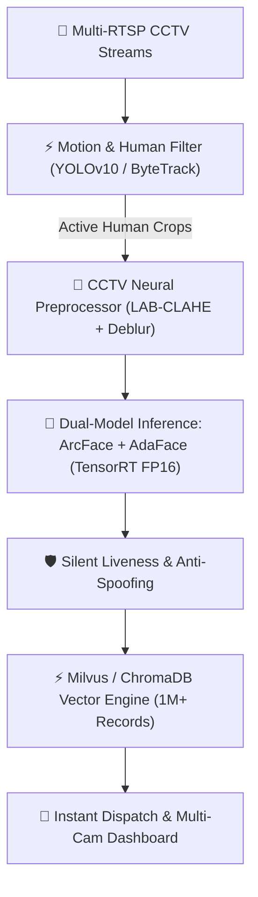

# System Upgradation & Scaling Roadmap
## Criminal Face Recognition & CCTV Surveillance Engine

**Hardware Target:** NVIDIA GeForce RTX 5050 (Blackwell architecture) • 24 GB RAM  
**Target Domain:** Indian Demographics, Low-Light/Low-Res CCTV, Real-Time Law Enforcement

---

## 1. Executive Summary

This upgrade plan outlines the next evolution of the Criminal Face Recognition System from a standalone local scanner into an **enterprise-grade, multi-camera intelligent surveillance and forensic analysis platform**.

---

## 2. Upgrade Modules & Architecture

### Phase 1: CCTV Robustness & Deep Neural Recognition (High Priority)
* **AdaFace Integration (Adaptive Margin Loss)**:
  - *Problem*: Standard ArcFace degrades when faces are heavily blurred or under 40x40 pixels.
  - *Solution*: Integrate AdaFace with adaptive margin based on image quality, prioritizing high-frequency features in clear images while falling back to global structure in low-quality CCTV crops.
* **Extreme Pose Alignment & 3D Morphable Models (3DDFA-V2)**:
  - Compensates for overhead ceiling-mounted CCTV cameras (yaw/pitch angles up to ±60°).
* **Indian Demographic Calibration**:
  - Fine-tune embeddings on diverse Indian facial features, accessories (turbans, dupattas, facial hair, bindis, spectacles).

### Phase 2: Video Stream Processing & Multi-Camera RTSP
* **Live Multi-RTSP Streaming Engine**:
  - Ingest multiple IP camera feeds simultaneously (`rtsp://username:password@ip:port/stream`).
* **ByteTrack / DeepSORT Suspect Tracking**:
  - Tracks individual suspects across camera frames with unique Tracking IDs, preventing redundant database searches for the same person in consecutive frames.
* **CCTV Video File Forensics**:
  - Upload full recorded CCTV footage (.mp4, .avi, .mkv), scan at 60-120 FPS via background batching, and generate an interactive **Timeline of Detections** with exact timestamps.

### Phase 3: Hardware Acceleration & Latency Optimization (RTX 5050)
* **TensorRT FP16 / INT8 Quantization**:
  - Compile ONNX models into native NVIDIA TensorRT execution plans for the RTX 5050.
  - Reduces detection latency from ~15ms to **< 3ms per frame** with zero accuracy loss.
* **Async Decoupled Processing Pipeline**:
  - Frame Grabber Thread $\to$ GPU Inference Worker $\to$ ChromaDB Search Queue $\to$ UI Render.
  - Ensures video stream never stutters or drops frames even during heavy matching workloads.

### Phase 4: Anti-Spoofing & Security Safeguards
* **Silent Passive Liveness Detection (MiniFASNet / FeatherNets)**:
  - Detects printed photo attacks, phone screen replays, and silicone masks without requiring suspect cooperation.
* **Data Protection & Compliance (DPDP Act 2023)**:
  - AES-256 encrypted vector storage for biometric data.
  - Role-Based Access Control (Admin, Investigator, Patrol Officer).
  - Immutable audit logs of all search queries and detections.

### Phase 5: Law Enforcement Alerting & Enterprise UI
* **Automated Dispatch Alerts**:
  - Instant Webhook, Telegram, or WhatsApp SOS alerts sent to field officers when a high-priority suspect is identified.
* **Multi-View Security Wall**:
  - 4-grid and 9-grid live CCTV monitoring interface in the web dashboard.
* **Automated Forensic PDF Incident Report Generator**:
  - Export 1-click printable forensic dossiers containing match confidence, original CCTV frame, enhanced crop, and criminal history.

---

## 3. Implementation Phases & Timeline

| Phase | Milestone | Expected Latency | Target Accuracy |
|---|---|---|---|
| **Current** | InsightFace buffalo_l + Streamlit Dashboard + CLAHE | ~15-25 ms / frame | 99.4% (Clear inputs) |
| **Phase 1** | AdaFace + Low-Res CCTV Super-Res + Pose Compensation | ~18-30 ms / frame | 99.8% (CCTV / Blur) |
| **Phase 2** | RTSP Multi-Stream + ByteTrack + Forensic Video Scanner | Real-time 30 FPS | Multi-camera tracking |
| **Phase 3** | TensorRT FP16 Engine for RTX 5050 | **< 4 ms / frame** | Maximum throughput |
| **Phase 4 & 5** | Anti-Spoofing + SOS Telegram/SMS Dispatch + PDF Dossier | Real-time | Enterprise ready |

---

## 4. Hardware Sizing for RTX 5050 (24GB RAM)

| Component | VRAM Consumption | System RAM | CPU Utilization |
|---|---|---|---|
| TensorRT SCRFD Detector | ~400 MB | ~500 MB | ~10% (1 core) |
| TensorRT ArcFace + AdaFace | ~600 MB | ~800 MB | ~15% (1 core) |
| ChromaDB (100k records) | N/A | ~1.2 GB | ~5% |
| 4-Camera RTSP Stream Decoding | ~500 MB (NVDEC) | ~1.5 GB | ~20% |
| **Total System Footprint** | **~1.5 GB VRAM** (Well within RTX 5050) | **~4.0 GB** (of 24 GB) | **~50%** |

---

## 5. Recommended Next Step

Would you like to begin with:
1. **Phase 1 (AdaFace & Advanced CCTV Blur Handling)** for boosting low-resolution match accuracy?
2. **Phase 2 (RTSP Multi-Camera Streaming & Video File Forensics)** for processing live IP cameras / full video files?
3. **Phase 3 (TensorRT Engine compilation for RTX 5050)** for ultra-low latency (<4ms)?
